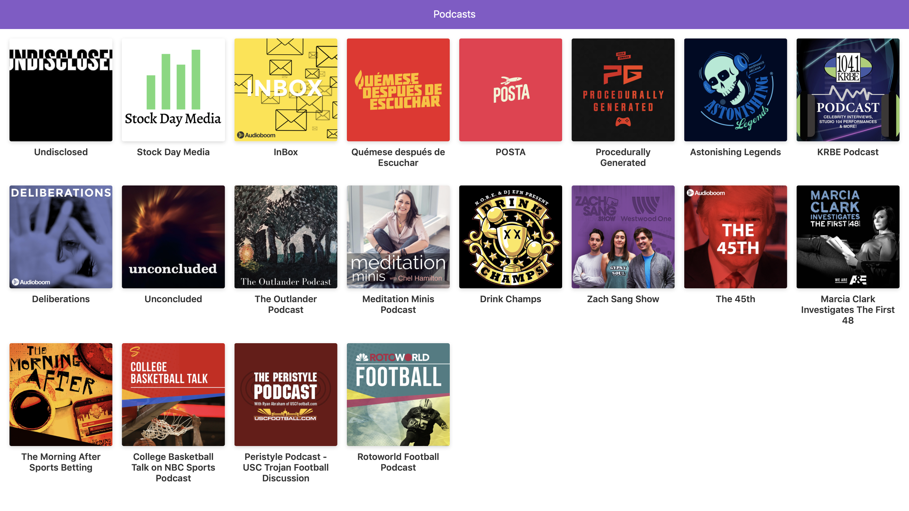

# App de Podcasts 

Podcasts app, implement with AudiBoom API , ReactJs and Server Side Rending ( SSR ) with Next.Js.

## How it works?

Requiere Node.JS 10

* `npm install` para instalar las dependencias.
* `npm run dev` para el entorno de desarrollo.
* `npm run build && npm start` para el entorno de producción.

## Licence

MIT
